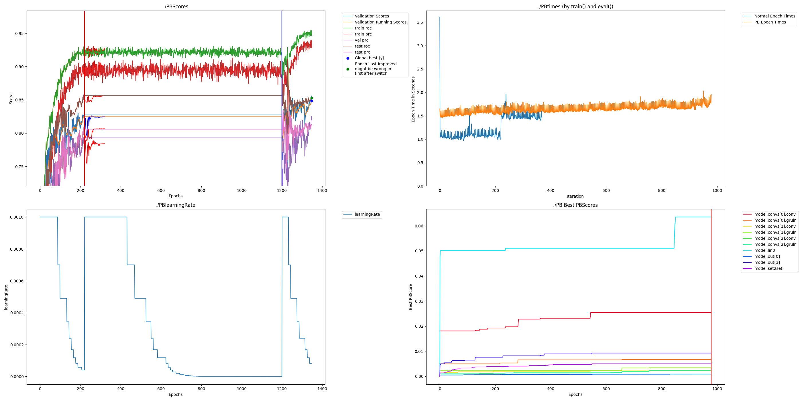

# PAI README
Checked out TrimNet source code January 10, 2024 from https://github.com/yvquanli/TrimNet.

First run:

pip install -r requirements.txt

Run original code with:

    CUDA_VISIBLE_DEVICES=0 python  trimnet_drug/source/run.py --gpu 0

Results:

    Epoch:199 bace test_loss:0.796 test_roc:0.740 test_prc:0.649 lr_cur:0.00000 time elapsed 0.02 hrs (1.1 mins)

Run PAI code with the following: 

    CUDA_VISIBLE_DEVICES=0 python  trimnet_drug/source/runPAI.py --gpu 0

Results:
    
    Epoch:1568 bace test_loss:0.741 test_roc:0.846 test_prc:0.804 lr_cur:0.00000 time elapsed 0.67 hrs (40.5 mins)

    

# Changes of Note

## model.py vs modelPAI.py

    GRUCellLayerNorm

This replicates the same as the standard PBSequential for linear layers but allows two outputs for use with a GRU

