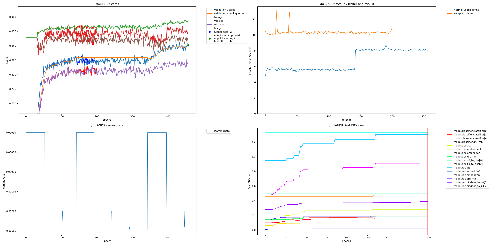

# PAI README
Checked out source code February 11, 2024 from https://github.com/reml-lab/mTAN.  Additional information can be found in the README there.

To run with PAI:

    pip install -r requirements.txt
    # This may tell you there is a dependency problem, but if you run it a second time and it does not come up again you can ignore it

Run original code with:

    python3 src/tan_classification.py --alpha 100 --niters 300 --lr 0.0001 --batch-size 50 --rec-hidden 256 --gen-hidden 50 --latent-dim 20 --enc mtan_rnn --dec mtan_rnn --n 8000 --quantization 0.016 --save 1 --classif --norm --kl --learn-emb --k-iwae 1 --dataset physionet

Results:
    
    Iter: 300, recon_loss: 15.8308, ce_loss: 0.0447, acc: 0.9805, mse: 0.0035, val_loss: 1.0100, val_acc: 0.8313, test_acc: 0.8137, test_auc: 0.7515

    
Run PAI code with the following. Multiplier 0.125 shows best compression for premium while 0.5 shows fully catching up in accuracy with less compression using freemium.

    CUDA_VISIBLE_DEVICES=1 python3 src/tan_classificationPAI.py --alpha 100 --lr 0.0001 --batch-size 50 --rec-hidden 256 --gen-hidden 50 --latent-dim 20 --enc mtan_rnn --dec mtan_rnn --n 8000 --quantization 0.016 --save 1 --classif --norm --kl --learn-emb --k-iwae 1 --dataset physionet --multiplier 0.5

Results of freemium:
    
    Iter: 655, recon_loss: 20.9376, ce_loss: 0.2609, acc: 0.8910, mse: 0.0048, val_loss: 0.3068, val_acc: 0.8703, test_acc: 0.8625, test_auc: 0.8147

    
# Changes of Note
## models.py vs modelsPAI.py

    reverseGru

One of the Grus in the mTAN network is processed in reverse and will require a different processing function.  So one of them is simply defined in this way so that can be done later.  You can see this because the reverse GRU in the forward function is "_ , out" rather than the typical "out , _" or "out , hidden".

    mtan_time_embedder module

Within the enc_mtan_rnn module there are two nn.linears that rather than being called as usual are passed through the learn_time_embedding function.  This function performs additional complex computation in between linear non-linearities. As a general rule, this is something that should be avoided.  To get that computation into the Dendrite processing as well, rather than include it as a function, it is added as a module which just performs the same computations in the forward function which Dendrites use automatically.  

## tan_classification.py vs tan_classificationPAI.py

    GRUCellProcessor and ReverseGRUCellProcessor
    
Processing functions for GRU and reverseGru.  One works with the cell state and the other with the hidden stage

    fullModel
    
The original script does not define a single full model with a forward function but rather calls multiple models during the training loop.  This module just groups them together so convertNetwork can hit everything.
