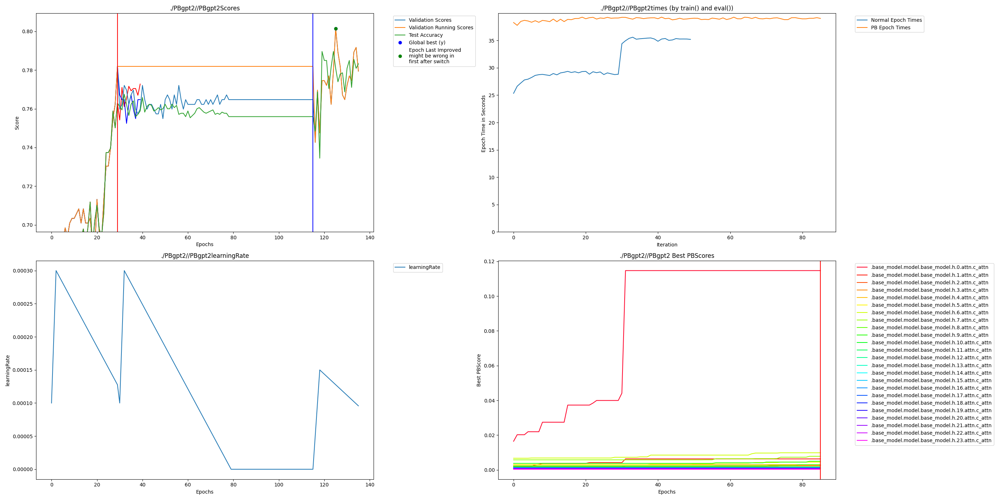

# Parameter Effecient Fine Tuning

This example shows Parameter Effecient Fine Tuning on GPT2 leveraging the example from the official transfomeres [peft](https://github.com/huggingface/peft/tree/main) repo.

## Setup

    git clone https://github.com/huggingface/peft.git
    git clone https://github.com/PerforatedAI/PerforatedAI-Transformers.git
    cd peft
    pip install -e .
    cd ../PerforatedAI-Transformers
    pip install -e .
    pip install perforatedai evaluate scikit-learn 

## Running

Original GPT scores:
    
    epoch eval 49: {'accuracy': 0.7647058823529411, 'f1': 0.8421052631578947}
    epoch test 49: {'accuracy': 0.7478260869565218, 'f1': 0.8260695721711315}

Run Perforated AI code with:

    CUDA_VISIBLE_DEVICES=0 python LoRA-perforatedai.py

Example output should look similar to here:

