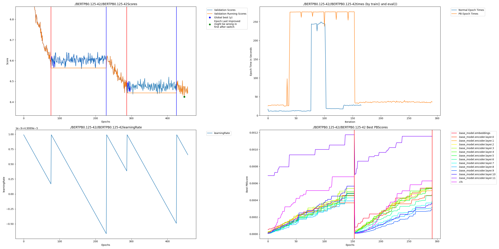

# Language Modeling Example

## Setup

    git clone https://github.com/PerforatedAI/PerforatedAI-Transformers.git
    cd PerforatedAI-Transformers
    pip install -e .
    pip install perforatedai evaluate scikit-learn accelerate
    cd ..

## Run

    export HF_HOME=./data
    CUDA_VISIBLE_DEVICES=1 python run_mlm_perforatedai.py --model_name_or_path bert-base-uncased --dataset_name wikitext --dataset_config_name wikitext-2-raw-v1 --per_device_train_batch_size 2 --per_device_eval_batch_size 2 --do_train --do_eval --output_dir /tmp/test-mlm --cache_dir ./data --overwrite_output_dir

    Width settings can be changed on line 452 to produce a graph like the following:

    

