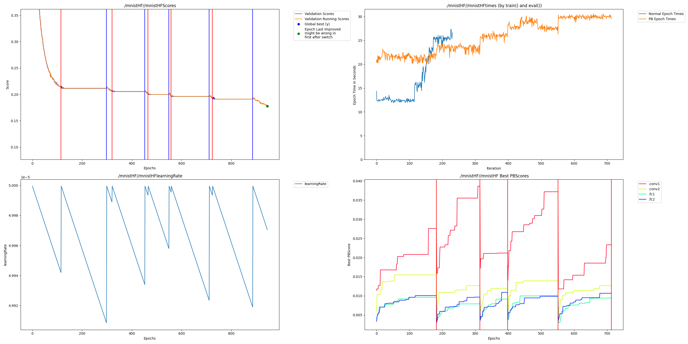

# Huggingface MNIST Instructions

## Transformers Fork

To work with hugginface some internal mechanisms of the trainer must be changed to do Perforated AI steps where they need to be done.  We have created a repo that is a fork which has everything in the correct place.  Get it and install requirements by running:

    pip install -r requirements.txt
    git clone https://github.com/PerforatedAI/PerforatedAI-Transformers.git
    cd PerforatedAI-Transformers
    pip install -e .
    cd ..
    pip install perforatedai

    
## Other Examples
The rest of this readme covers the mnist example in this folder.  But additional examples are as follows:
    [BERT Language Modeling](https://github.com/PerforatedAI/PerforatedAI-Transformers/tree/main/examples/pytorch/language-modeling)
    
## Code Changes

### Save Name

Because the evaluation function is inside the HF trainer code you will need to set a global for the save name you want to use.  This can be done as follows:

    PBG.saveName = 'mnistHF'

### Trainer

You need to make sure that the trainer actually does evaluation regularly.  This can be done with eval_steps and eval_strategy in the training_args.  Also make sure that you set train_epochs to just be a large number so it will exit when we say to and not when the epochs runs out.  Example settings are as follows:

    training_args.num_train_epochs = 1000000.0
    training_args.eval_strategy = "steps"
    training_args.eval_steps = 500

### Deleting base_model

Huggingface models sometimes make a copy of themselves so the model has two pointers to the full architecture.  This will cause an error saying "some tensors share memory".  The second model will often be called base_model.  It can just be deleted as follows.

    model = PBU.convertNetwork(model)
    del model.base_model
    
### TestingDendriteCapacity

While you are testing the dendrite capacity you want to have eval_strategy set to "steps" and eval_steps set to a very low number.

    training_args.eval_strategy = "steps"
    training_args.eval_steps = 10
    
### Ignoring Shared Tensors

Some models within huggingface don't play niceley with safetensors, which is the method used to save Perforated AI models.  If you encounter the following error:
    
    Some tensors share memory, this will lead to duplicate memory on disk and potential differences when loading them again
    
This means the model is setup in a way that has tensors sharing memory.  If you created the model you should fix this problem.  But if you did not create the model, it can generally be ignored.  At the top of your file with the rest of your imports just overwrite the function within safetensors that finds shared tensors with a function that just returns empty to convince it there are no shared tensors.

    import safetensors
    from collections import defaultdict
    def _ignore_shared_tensors(state_dict):
        tensors = defaultdict(set)
        return tensors
    
    safetensors.torch._find_shared_tensors = _ignore_shared_tensors
    
## Running
    
Then just run as usual:

    CUDA_VISIBLE_DEVICES=0 python mnist_huggingface_perforatedai.py 

## Example Output
This shows an example output which quit after 2 Dendrite Epochs.

