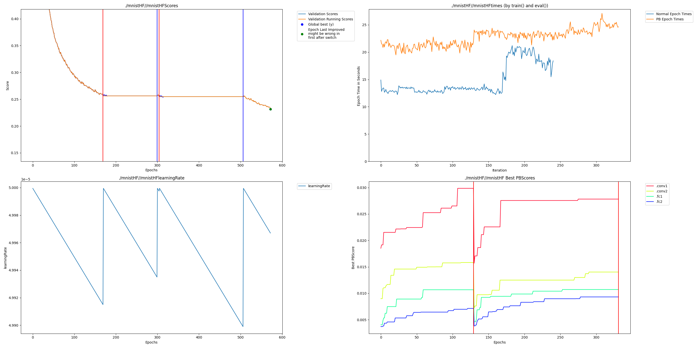

# Huggingface MNIST Instructions

## Modifications

To work with hugginface some internal mechanisms of the trainer must be changed to do Perforated AI steps where they need to be done.  We have created a repo that is a fork which has everything in the correct place.  Get it and install requirements by running:

    pip install -r requirements.txt
    git clone https://github.com/PerforatedAI/PerforatedAI-Transformers.git
    cd PerforatedAI-Transformers
    pip install -e .
    cd ..
    pip install perforatedai
    
## Running
    
Then just run as usual:

    CUDA_VISIBLE_DEVICES=0 python mnist_huggingfacePAI.py 

## Example Output
This shows an example output which quit after 2 Dendrite Epochs.

