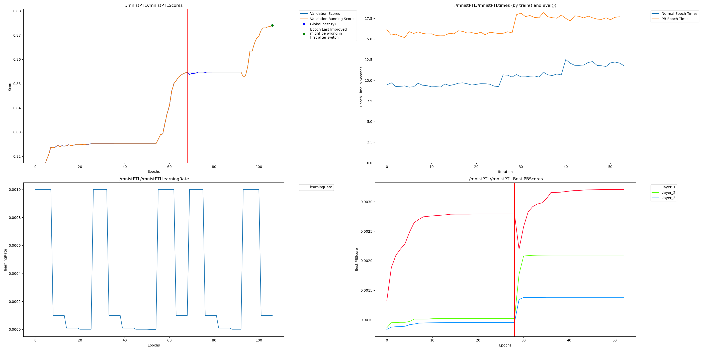

# PyTorch Lightning MNIST Example

A note about this example is that the loss contonues still going down in the epochs that are erased where usually those epochs the validations core is flatlined.  This is because when using loss instead of accuracy score the loss can sometimes slowly go down for a very long time.  For this reason rather than stop when the loss stops going down at all, if the loss is decreasing slow enough that is also ok to trigger a switch to Dendrites. So instead of stopping entirely, the switch happens when over 10 epochs the loss has only minimally decreased.

## Modifications

To work with hugginface some internal mechanisms of the trainer must be changed to do Perforated AI steps where they need to be done.  We have created a repo that is a fork which has everything in the correct place.  Get it by running:

    pip install -r requirements.txt
    git clone https://github.com/PerforatedAI/PerforatedAI-Transformers.git
    cd PerforatedAI-Transformers
    pip install -e .
    cd ..
    pip install perforatedai
    
## Running
    
Then just run as usual:

    CUDA_VISIBLE_DEVICES=0 python mnist_huggingfacePAI.py 

## Example Output
This shows an example output which quit after 2 Dendrite Epochs.

