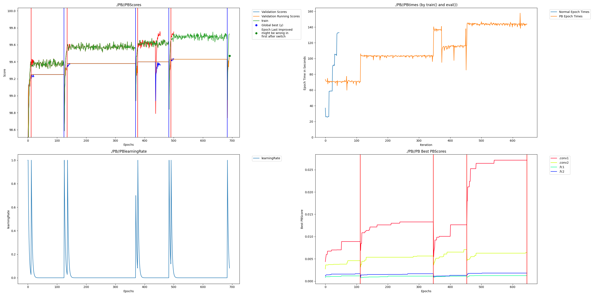

# MNIST example

This is a basic example that just runs Perforated Backpropagaitontm with the default mnist example from the pytorch repository.  mnist.py is the original and mnist_PAI.py is the baseline changes to add it to the system.  mnist_PAI_experimental.py adds some additional comments as well as options which allows additional PAI functionality and datasets to be tested.

Install requirements.txt first with pip

Then just run mnist_perforatedai to test it out which can be compared with the original mnist.py to see what was changed.

