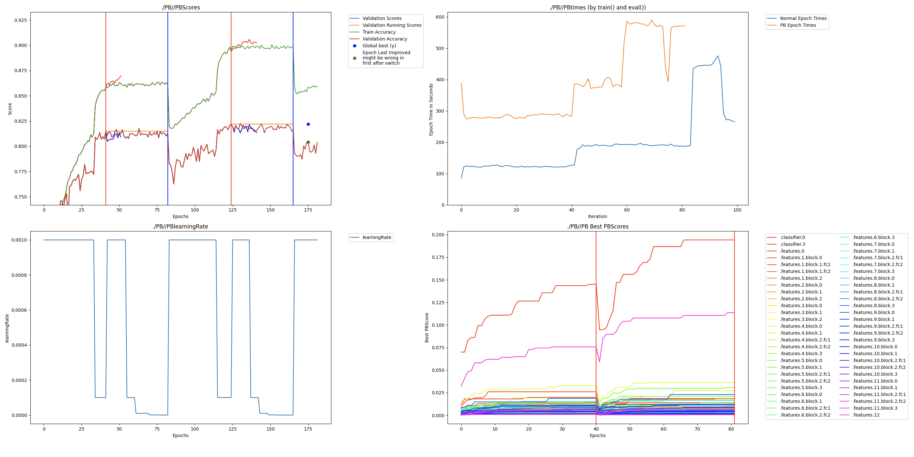

# MobileNet Readme

This is a basic example that runs experiments and analysis on different MobileNet variants, including model performance comparisons between original and perforated versions.

## Setup

> **Requires Python 3.10 or newer**

```bash
uv venv --seed
uv sync
```

## Run

```bash
CUDA_VISIBLE_DEVICES=0 python train_main.py
```

## Example mobilenet small output with 50% width

