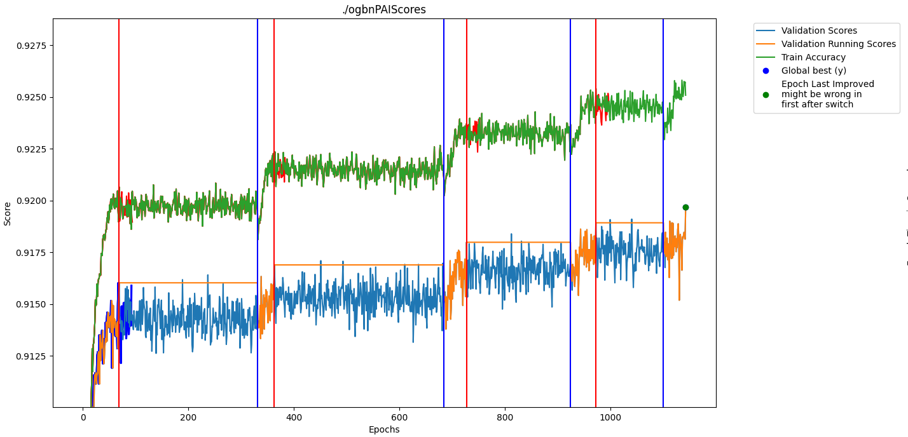

# PAI README
checked out from torch geometric 9.27.2024

   docker pull nvcr.io/nvidia/pyg:24.11-py3

Run docker from torch_geometric directory with --shm-size 8G

   docker run --gpus all -i --shm-size=8g -v .:/pai -w /pai -t nvcr.io/nvidia/pyg:24.11-py3 /bin/bash

Within Docker

    pip install -e .
    cd examples
    pip install PAI wheel file
    
Run original with:

    CUDA_VISIBLE_DEVICES=0 python ogbn_train.py --dataset ogbn-products --batch_size 128

Results:

    Test Accuracy: 77.19%
    
Run PAI with:

    CUDA_VISIBLE_DEVICES=0 python ogbn_train_perforatedai.py --dataset ogbn-products --batch_size 128 --saveName ogbnPAI
    
Results:

    Test Accuracy: 78.37%

Generated Graph should look similar to the following:
    

