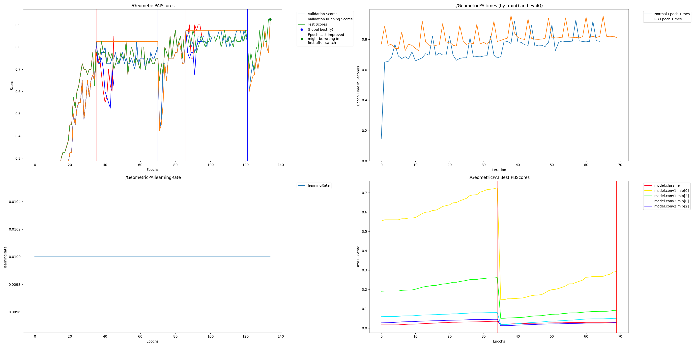

This example is taken from [the PyTorch Geometric point cloud example](https://pytorch-geometric.readthedocs.io/en/latest/tutorial/point_cloud.html) on 9/22/2024.

To replicate our results you can build the included docker container with:

    docker build -f Dockerfile --build-arg USER_ID=$(id -u) --build-arg GROUP_ID=$(id -g) -t nvidiadevelconda .
    
Then run with:

    docker run --gpus all -i -v .:/pai -w /pai -t nvidiadevelconda /bin/bash

Once inside the container first install your verison of the Perforated AI package which should default to torch 2.4.1 then run the install from [torch_geometric](https://pytorch-geometric.readthedocs.io/en/latest/notes/installation.html):

    pip install torch_geometric
    pip install pyg_lib torch_scatter torch_sparse torch_cluster torch_spline_conv -f https://data.pyg.org/whl/torch-2.4.0+cpu.html

Run original with:

    CUDA_VISIBLE_DEVICES='' python pointnet_tutorial.py
        
Results:

    Epoch: 50, Loss: 0.4780, Test Acc: 0.8750

Run PAI with:

    CUDA_VISIBLE_DEVICES='' python pointnet_tutorial_perforatedai.py

Results:

    Final: 226, Loss: 0.2604, Train Acc: 0.9000, Test Acc: 0.9500

