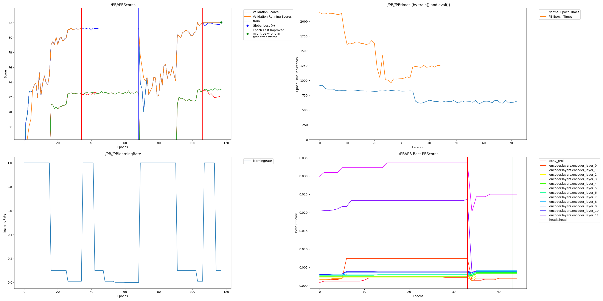

# CIFAR 10 example

This is a basic example that just runs Perforated Backpropagaitontm with the default mnist example from the pytorch repository on the emnist dataset with a vision transformer. The improvement is a modest 4%, but still included in the examples for anyone who would like to try ViT on their own datasets.

## Setup

    pip install -r requirements.txt

## Run

    CUDA_VISIBLE_DEVICES=0 python emnist_transformer_perforatedai.py

