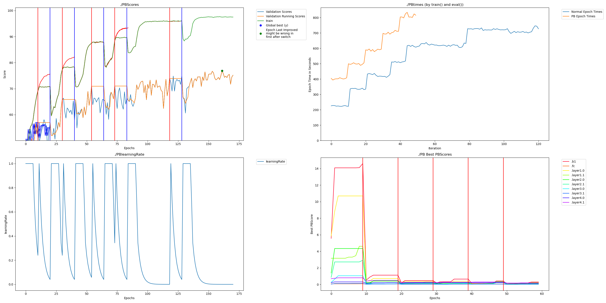

# CIFAR 10 example

This is a basic example that just runs Perforated Backpropagaitontm with the default mnist example from the pytorch repository on the CIFAR 10 dataset.  mnist.py is the original and cifar10_resnet_PAI.py switches the dataset and adds the code for Perforated AI.

Install requirements.txt first with pip

CUDA_VISIBLE_DEVICES=0 python cifar10_resnet_PAI.py

